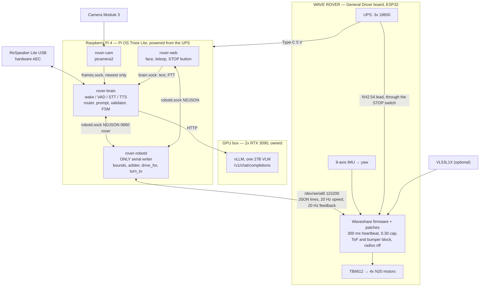

# rover

An indoor voice-and-vision robot on a Waveshare WAVE ROVER chassis. You speak
to it, it looks at the room through one camera, a 27B vision-language model on
a GPU box in the next room proposes one action, a program on the Pi decides
whether that action is allowed, and the motor controller's firmware decides
whether it is safe. Three layers, each able to stop the robot alone, plus a
switch in the battery lead that needs none of them.

Every line of it runs on a MacBook first: a simulated controller speaking the
real wire protocol, a fake camera, text input instead of a microphone, a fake
model endpoint. The gates run there before any hardware exists.

Two documents govern the design. `ARCHITECTURE.md` is the original
specification, 38 numbered decisions and 24 safety invariants, frozen.
`docs/adr/0013-wave-rover-open-loop.md` is the amendment that moved the design
onto the WAVE ROVER; where the two disagree, the ADR wins, and the table at the
top of `ARCHITECTURE.md` says exactly where they disagree.

## Topology



Four processes on the Pi, because anything that can crash must run somewhere
other than the one thing that must not. `robotd` is the only writer of the
serial port; the socket is mode 0660, group `rover`, so "only robotd commands
motion" is a filesystem permission rather than a convention.

## Simulation on a Mac, in three commands

No robot, no microphone, no GPU. You need `uv` and Python; everything else the
repo pins.

```bash
uv sync                                              # 1. the four runtime deps + test tools
make sim                                             # 2. fakebox, rover-stub on TCP, robotd, cam, brain, web
make test                                            # 3. unit tests
```

`make sim` health-checks each process, prints what to do next, and tears
everything down on Ctrl-C. While it runs:

```bash
uv run roverctl utter "turn left ninety degrees"     # into the real router, validator and executor
uv run roverctl drive-for 1.0 0.15                   # one second at power 0.15, straight to robotd
open http://127.0.0.1:8080/                          # face page and the STOP button
open http://127.0.0.1:8080/teleop                    # teleop pad
uv run python -m rover_devtools.wirecat --tcp 127.0.0.1:7777   # watch the wire
```

The simulated controller implements `docs/protocol.md` line for line, with a
first-order wheel model and an integrating heading, and it injects faults:
`--tof-mm 200`, `--bumper`, `--vbat 9.5`, `--stock` (unpatched firmware, which
robotd refuses to drive), `--freeze-after 5` (a hung controller),
`--drop-every 3`, `--garbage`, `--latency-ms 80`. `make sim STUB_FLAGS="--stock"`
is the quickest way to watch robotd refuse to move.

Configuration is `config/robot.mac.toml`. Nothing in it is a code branch: the
fakes are selected by `[link] backend`, `[camera] backend`, `[stt] backend` and
`[tts] backend`, and the Pi profile differs only in those keys and the paths.

## Deploy to the Pi

`docs/wiring.md` first, in full, before power. Then in this order.

**Box, in parallel.**

1. `docker compose --env-file box/.env -f docker/compose.box.yml up -d vllm`
2. `python -m rover_brain.box_probe --url "$ROVER__BOX__URL"` writes
   `box_caps.json`; if `supports_oneof` is false, set
   `[box] structured_output_mode = "json_object"`.
3. `make gate-g1 BOX=real`

**Firmware, from the Mac.** The controller ships with Waveshare's stock
firmware, which has a 3 s heartbeat, no power cap, an open Wi-Fi access point
and an ESP-NOW receiver that accepts broadcast commands. robotd will not drive
it. `firmware/README.md` has the detail.

4. `make firmware` compiles the fork in the arduino-cli container.
5. Unplug the Pi's data wires, connect USB, `make flash PORT=/dev/tty.usbserial-XXXX`.
6. With a serial terminal at 115200, send `{"T":1007}` and read the banner.

**Pi.**

7. Flash Raspberry Pi OS **Trixie 64-bit Lite** with Imager (hostname, user,
   SSH key, Wi-Fi). `ssh` in. `sudo apt install -y git`.
8. ```
   sudo install -d -o "$USER" -g "$USER" /opt/rover
   git clone https://github.com/tedthizzy/bot /opt/rover
   sudo /opt/rover/hosts/pi/deploy/install.sh
   ```
   The installer creates the users and directories, installs `uv`, builds the
   venvs, installs the udev rule and the four units, and writes the boot lines
   that hand UART0 to the header: `enable_uart=1`, `dtoverlay=disable-bt`, the
   serial console removed from `cmdline.txt`. It enables the units and does
   **not** start them.
9. **Reboot.** The UART change takes effect on the next boot.
10. Wire per `docs/wiring.md`: Pi powered from the UPS's Type-C, three data
    wires (ground, 8, 10), the stop switch in the battery lead, wheels off the
    floor. Power the rover.
11. `/opt/rover/.venv/bin/python -m rover_devtools.wirecat /dev/serial0` shows
    the banner and feedback lines.
12. `sudo /opt/rover/hosts/pi/deploy/preflight.sh`, then
    `sudo systemctl enable --now rover.target`, then preflight **again** with the
    target up. The two halves are exclusive by design: the banner read needs
    robotd stopped, the socket checks need it running.

Preflight refuses to continue if the firmware is stock, or if the fork's
compiled heartbeat and cap disagree with `config/robot.toml`.

**First motion, wheels off the ground.**

13. `roverctl drive-for 0.5 0.10`, then `roverctl turn-to 90`. Confirm with
    `roverctl watch` that the heading moves the right way; if it moves the wrong
    way, set `[link] yaw_sign = -1`.
14. Gate G2 on hardware: `tests/gates/g2_bench.md`. Stop the stream and time the
    wheels stopping. Press the stop switch with robotd streaming.
15. `roverctl utter "turn left ninety degrees"`, text mode, no microphone.
16. Speech input needs a recogniser, and this repository ships none; see
    `hosts/pi/deploy/install.sh` and `[stt]` for what to put where. Until then
    text is the whole voice loop.
17. Wheels on the ground only after G2 passes on hardware and G4-a (the
    time-of-flight block) passes with the sensor fitted.

## Safety model

Four layers. Each one stops the robot without the others.

1. **The model proposes.** One JSON object with integer arguments: a power and
   a duration, or a heading. No distances. It is not trusted, and constrained
   decoding is not a safety layer: it guarantees syntax, not intent.
2. **`robotd` validates.** Strict schema, finite bounds, source allow-list bound
   to the connection's uid, replay window, a 12 s motion budget per instruction,
   fresh observation, fresh feedback, and a check that the controller is the
   patched firmware. It streams the speed command at 20 Hz from the same loop
   that owns the goal, zeros when idle, so a frozen robotd stops sending.
3. **The firmware decides.** A 300 ms heartbeat it will not raise over the
   wire, a 0.30 power cap on every input path, forward blocked by the
   time-of-flight sensor and the bumper while reverse and rotation stay legal,
   all motion refused on a low pack, motors off at boot, radios compiled out.
4. **The switch.** A stop switch in the battery lead removes drive power from
   the motors and the controller. With the Pi on the UPS's own 5 V, the Pi
   stays up and reports the loss.

Two stop authorities are counted: the switch and the STOP button on the web
page. Saying "stop" out loud is a third channel and it is best-effort; its
latency is measured and no safety property depends on it.

Stated plainly, what is weaker than the original design: there is no checksum
and no session on the wire, so a corrupted line is dropped by the JSON parser
rather than a CRC; there is no encoder, so a stalled wheel is invisible to the
controller and is bounded only by the instruction's time budget; the
open-loop `drive_for` travels a distance that depends on the floor. G5
measures that distance and sets `[limits] power_default` from it.

## Repo map

```
ARCHITECTURE.md   the v1 specification, frozen, with the v1.1 amendment table at the top
docs/adr/0013-*   the chassis decision and the restated safety chain
docs/protocol.md  the rover link: Waveshare JSON lines, the fork's fields, stop flags, banner
docs/wiring.md    power, the three data wires, the stop switch, the sensors
config/           robot.example.toml (committed), robot.mac.toml (simulation),
                  robot.toml (yours, gitignored)
packages/
  rover_contracts/  wire codec, schemas, units, config, skill catalog — imported, never redefined
  rover_devtools/   rover-stub, fakebox, wirecat, roverctl, doctor
hosts/pi/
  rover_robotd/     the only serial writer: bounds, arbiter, drive_for, turn_to, budget
  rover_brain/      audio, router, prompt, box client, validator, FSM
  rover_cam/        picamera2 and the fake backend
  rover_web/        face page, teleop, the STOP button
  deploy/           install.sh, preflight.sh, sync.sh, check-secrets.sh, units, udev
hosts/android/    the planned second host: module skeleton, generated data classes, one test
firmware/         Waveshare ugv_base_general (GPL-3.0) + patches/, build.sh, flash.sh
box/              system prompt, generated JSON schemas, bring-up
docker/           arm64 parity image, the box compose. No Docker on the Pi.
tests/            unit/, gates/, fixtures/
legacy/           the retired ESP32-S3 controller track, reference only
docs/             verification.md, gates.md, research/, deviations.md
logs/gates/       gate results as JSON — evidence, not assertions
```

Start with `make doctor`: it prints the resolved configuration, the effective
limits, device and socket status, and whether the firmware fork in `firmware/`
agrees with the config. It is the first thing to run when a step fails.

## Licence

First-party code is **Apache-2.0** (`LICENSE`). `THIRD_PARTY.md` has the rest.
Three boundaries are worth knowing before you change anything:

- **`firmware/` is GPL-3.0-or-later.** It is Waveshare's firmware with our
  patches, and stays under Waveshare's licence. Nothing in it is imported by
  the Python; it talks to the Pi over a serial line.
- **Piper is GPL-3.0-or-later and is never imported.** The speech synthesiser
  runs as a subprocess out of its own virtual environment.
- **No wake-word model ships here, and none may.** openWakeWord's pre-trained
  models are CC BY-NC-SA 4.0; train your own before setting
  `[audio] input = "wake"`.

## What this is not

- **Not a product, and not safe around children, pets or stairs unattended.**
  It is a 1 kg machine on four motors with a 250 mm stopping zone in front and
  nothing behind. Keep the stop switch in reach.
- **Not autonomous navigation.** No map, no path planner, no odometry. It
  drives for a moment, turns to a heading, and looks again.
- **Not a manipulator.** No arm.
- **Not barge-in.** Audio is half-duplex: it does not listen while it speaks,
  and it does not speak while it moves.
- **Not phone-brained yet.** The model runs on a GPU box you own. The phone
  host under `hosts/android/` is a skeleton until the Pi stack has passed the
  gates on hardware.
- **Not measured on hardware.** Every gate has run only against the simulator.
  `docs/verification.md` says which invariants that covers and which wait for
  the rover.
