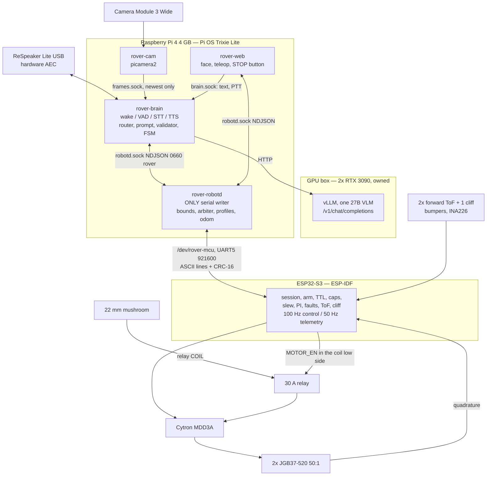

# rover

An indoor voice-and-vision robot. You speak to it, it looks at the room through
one camera, a 27B vision-language model on a GPU box in the next room proposes
one action, a program on the Pi decides whether that action is allowed, and a
motion controller decides whether it is safe. Three layers, each able to stop the
robot alone.

Every line of it runs on a MacBook first — simulated motion controller over a
pseudo terminal, fake camera, text input instead of a microphone, fake model
endpoint — and passes 19 of its 24 safety invariants there, before any hardware
exists.

`ARCHITECTURE.md` is the full specification: 38 numbered decisions, 24 safety
invariants, an exact serial grammar with golden frame vectors. It is frozen; see
`docs/adr/README.md` for how it changes.

## Topology



Four processes on the Pi, because anything that can crash must run somewhere
other than the one thing that must not. `robotd` is the only writer of the
serial port; the socket is mode 0660, group `rover`, so "only robotd commands
motion" is a filesystem permission rather than a convention.

## Simulation on a Mac, in three commands

No robot, no microphone, no GPU. You need `uv` and Python; everything else the
repo pins.

```bash
uv sync                                              # 1. the four runtime deps + test tools
make sim                                             # 2. fakebox, mcu-sim on a pty, robotd, cam, brain, web
make test                                            # 3. unit + contract, Python and the C core
```

`make sim` health-checks each process, prints what to do next, and tears
everything down on Ctrl-C. While it runs:

```bash
uv run roverctl utter "turn left ninety degrees"     # into the real router, validator and executor
open http://127.0.0.1:8080/                          # face page and the STOP button
open http://127.0.0.1:8080/teleop                    # joystick
uv run python -m rover_devtools.wirecat run/mcu.pty  # watch the frames on the wire
```

The simulated controller links **the same C code** the real firmware does, over
a pseudo terminal, and it injects faults: `obstacle=231`, `tof_error=fl`,
`cliff`, `bumper`, `estop`, `ttl_drop`, `crc_flip`, `seq_replay`,
`reset_mid_drive`, `hang=1000`, `vbat=9.5`, `stall_one_channel`. That is how
nineteen invariants go green with no hardware.

Configuration is `config/robot.mac.toml`. Nothing in it is a code branch: the
fakes are selected by `[serial] backend`, `[camera] backend`, `[stt] backend`
and `[tts] backend`, and the Pi profile differs only in those keys and the
paths.

## Same-day deploy to the Pi

Roughly 45 minutes with a warm apt cache, in this order. `ARCHITECTURE.md` §11
is the full version; this is the shape.

**Box, 10 minutes, in parallel.**

1. `docker compose --env-file box/.env -f docker/compose.box.yml up -d vllm`
2. `python -m rover_brain.box_probe --url "$ROVER__BOX__URL"` — writes
   `box_caps.json`; if `supports_oneof` is false, set
   `[box] structured_output_mode = "json_object"`.
3. `make gate-g1 BOX=real`

See `box/README.md` for the one curl that proves images and structured output
work through the real endpoint.

**Firmware, from the Mac, 10 minutes.**

4. `make firmware`
5. `make flash PORT=/dev/tty.usbserial-XXXX` — native `esptool`, because Docker
   Desktop on macOS has no USB passthrough.

**Pi, 20 minutes.**

6. Flash Raspberry Pi OS **Trixie 64-bit Lite** with Imager (hostname, user, SSH
   key, Wi-Fi). `ssh` in.
7. `sudo apt install -y git` — git is not on a Lite image, and everything
   below needs the clone. `install.sh` installs the rest of
   `deploy/apt-packages.txt` for you.
8. ```
   sudo install -d -o "$USER" -g "$USER" /opt/rover
   git clone https://github.com/tedthizzy/bot /opt/rover
   sudo /opt/rover/deploy/install.sh
   ```
   `/opt` is `root:root 0755`, so a plain `git clone /opt/rover` fails — and a
   `sudo git clone` leaves a root-owned tree that `deploy/sync.sh` then cannot
   write into. `install.sh` creates the users and directories, installs `uv`,
   builds the two venvs (`.venv` with system site packages for cam, robotd and
   web; `.venv-brain` without, for the speech extra), puts Piper in a third,
   installs the udev rule, the four units, the watchdog and logrotate, and
   writes the `/boot/firmware/config.txt` lines: `dtoverlay=uart5`, the fan
   overlay, `gpio-shutdown`, `camera_auto_detect=1`, `dtparam=watchdog=on`, and
   `arm_boost=1` on a rev 1.4 board. **`gpio-poweroff` is deliberately not among
   them** — it goes in at step 17. It `enable`s the four units and does **not**
   enable `rover.target`, so nothing starts before preflight has passed.
9. **Reboot** — the `config.txt` lines only take effect on the next boot, and
   `/dev/rover-mcu` does not exist until they do.
10. Disconnect USB, wire UART5, and read the boot banner on the operational
    link: `/opt/rover/.venv/bin/python -m rover_devtools.wirecat /dev/rover-mcu`.
11. `sudo /opt/rover/deploy/preflight.sh`, then
    `sudo systemctl enable --now rover.target`.
11b. `sudo /opt/rover/deploy/preflight.sh` **again**, now that the target is
    up. The two halves are mutually exclusive on purpose: the banner read needs
    `rover-robotd` stopped, and the socket-permission and `hello`/`welcome`
    checks need it running. Preflight prints this instruction itself when it
    has skipped the bus half.

Preflight asserts, among other things, that the firmware's compiled
`safety_hash` equals a CRC-32 over the seven `[safety]` mirror keys in
`config/robot.toml`. A firmware built with different stop distances than the
configuration claims cannot pass it.

**First voice turn, wheels off the ground.**

12. `cd /opt/rover && ./.venv/bin/python tests/gates/g3/run_g3.py --duration 1800
    --hardware` — the G3a soak. The gate script puts `packages/` and
    `tests/gates` on `sys.path` itself, so it needs no `pytest`: the robot's
    venvs deliberately carry none, and installing the dev group into
    `/opt/rover/.venv` would put test tooling in the environment `rover-robotd`,
    `rover-cam` and `rover-web` execute from. `make gates-pi` runs exactly this
    line; if you want the pytest wrapper on the Pi, give it a separate
    environment: `UV_PROJECT_ENVIRONMENT=/opt/rover/.venv-dev uv run --group dev
    pytest tests/gates/g3 -m gate`.
13. `roverctl utter "turn left ninety degrees"` — text mode, no microphone.
    `install.sh` symlinks `roverctl` into `/usr/local/bin`; the full path is
    `/opt/rover/.venv/bin/roverctl`.
14. **Speech input needs a recogniser, and this repository ships none.**
    `[stt] backend` is `"text"` out of the box and `install.sh` downloads
    nothing into `/data/models/stt`, because the model is the G3b bake-off's
    pick, not a decision made here. To use push-to-talk, put a sherpa-onnx
    streaming Zipformer int8 in `[stt] model_dir` under exactly the four names
    `SherpaStt` opens — `tokens.txt`, `encoder.onnx`, `decoder.onnx`,
    `joiner.onnx` — then
    ```
    sudo nano /opt/rover/config/robot.toml     # [stt] backend = "sherpa"
                                               # [audio] input  = "ptt"
    sudo systemctl restart rover-brain
    ```
    and hold the PTT button on `/ptt`. `preflight.sh` fails if `[audio] input`
    is not `text` while no usable recogniser is configured, so run it again
    after the edit. Until then step 13's text path is the whole voice loop.
15. `[audio] input = "wake"` — same edit and the same restart — only after G3a,
    the 30-minute soak, is clean, and only with a self-trained
    `rover.tflite` in place (see **Licence** below)
16. Wheels on the ground only after G2-e, G2-i and G4-a pass
17. Only then, on battery, with the MCU's rail control wired, add
    `dtoverlay=gpio-poweroff,gpiopin=26`. It is last because with it installed a
    `reboot` requires the MCU to cycle the Pi rail — which is why the edit loop
    is `deploy/sync.sh`, not a reboot.

## Safety model

Four layers. Each one stops the robot without the others.

1. **The model proposes.** It emits one JSON object with integer arguments and
   no distances. It is not trusted, and constrained decoding is not a safety
   layer — it guarantees syntax, not intent.
2. **`robotd` validates.** Strict schema, finite bounds, source allow-list bound
   to the connection's uid, replay window, per-instruction budget of 1.5 m and
   12 s, and a permission check at dispatch time rather than before the network
   call. A stale camera frame or a stale link refuses motion but never refuses
   speech.
3. **The controller decides.** Compiled caps that no frame can raise, a 300 ms
   frame time-to-live on its own clock, forward blocked by the forward
   rangefinders, bumpers and cliff sensor while reverse and rotation stay legal,
   an asymmetric slew limiter that brakes four times harder than it accelerates,
   and four independent current limits.
4. **The hardware.** A 22 mm mushroom button breaks the relay coil that feeds
   the motor driver. Firmware can open that relay and cannot close it against an
   open button. The Pi and the logic tap upstream, so pressing it never powers
   anything down.

**Three stop authorities are counted:** the hardware button, the STOP button on
the web page, and the controller's frame time-to-live. **Saying "stop" out loud
is a fourth channel and it is best-effort.** Its latency is measured and
reported; no safety property depends on it. Do not treat the spoken word as an
emergency stop — that is what the mushroom button is for.

**Recovering from a latched fault.** The STOP button clears nothing; it
latches. The face page grows a row of `clear <fault>` buttons whenever
`state.mcu.fault` shows a latched bit — `wdt_reboot` after the controller's
watchdog reset it, `brownout` after a sagging pack, `obstacle_latched` after a
half-minute parked against a wall — and each one sends a `clear` naming that
bit. The controller refuses a clear whose cause is still present, and a clear
never re-arms: the next motion command arms through the normal policy. From a
shell the same thing is `roverctl clear wdt_reboot --source web`, which must run
as the `rover-web` user because `[bus] clear_sources` is `["web"]` and the
source is checked against the peer's uid.

**The web surface is unauthenticated and binds to loopback.** `POST /utter`
reaches a motion skill through the router and `POST /clear` clears a latched
fault, with no token and no middleware, so `[web] bind` defaults to
`127.0.0.1`: reach the page over an SSH tunnel, or set `bind` to a LAN address
only on a network you trust every device on. Nothing else in this design assumes
a trusted network.

Two residual risks are stated rather than solved. **Reverse is unsensed** —
there is no rear rangefinder — and is bounded only by a 150 mm/s controller
clamp and a 30 cm host cap. **A wedged control task holds the last motor
command for up to one second**, about 300 mm at full speed, past the 250 mm stop
zone; the only redundant partner there is the human hand on the button.
`ARCHITECTURE.md` §8 carries all four.

## Repo map

```
ARCHITECTURE.md   the specification. Frozen; changed only through docs/adr/
config/           robot.example.toml (committed), robot.mac.toml (simulation),
                  robot.toml (yours, gitignored)
packages/
  rover_contracts/  wire formats, schemas, units, config — imported, never redefined
  rover_robotd/     the only serial writer: bounds, arbiter, profiles, odometry
  rover_cam/        picamera2 and the fake backend
  rover_brain/      audio, router, prompt, box client, validator, FSM
  rover_web/        face page, teleop, the STOP button
  rover_devtools/   mcu-sim, fakebox, wirecat, roverctl, doctor
firmware/
  core/             freestanding C11, zero IDF headers — mcu-sim links this too
  main/             ESP-IDF glue: PCNT, MCPWM, GPTimer, I2C, UART
box/                system prompt, generated JSON schemas, bring-up
deploy/             install.sh, preflight.sh, sync.sh, check-secrets.sh,
                    systemd units, the udev rule
docker/             arm64 parity image, the box compose. No Docker on the Pi.
tests/              unit/, contract/serial_vectors.jsonl, gates/, fixtures/
docs/               wiring.md, gates.md, adr/, research/, deviations.md
logs/gates/         gate results as JSON — evidence, not assertions
```

Start with `make doctor`: it prints the resolved configuration, the effective
limits, device and socket status, and the environment's import map. It is the
first thing to run when a step fails. It reads `config/robot.toml` when one
exists — the real robot's — and falls back to `config/robot.mac.toml`, the
simulation profile, when it does not.

## Licence

First-party code is **Apache-2.0** (`LICENSE`). `THIRD_PARTY.md` has the rest.
Two boundaries are worth knowing before you change anything:

- **Piper is GPL-3.0-or-later and is never imported.** The speech synthesiser
  runs as a subprocess out of its own virtual environment at
  `/opt/rover/.venv-tts`, and appears in no dependency list here. Importing it
  would make this repository unable to be Apache-2.0.
- **No wake-word model ships here, and none may.** openWakeWord's pre-trained
  models are CC BY-NC-SA 4.0, so `[wake] model` points at
  `/data/models/wake/rover.tflite` and nothing in this repository or in
  `install.sh` puts a file there: train your own (about an hour in the provided
  notebook) before setting `[audio] input = "wake"`. `[vad] model` names
  `/data/models/stt/silero_vad.onnx`, which is likewise not shipped.

## What this is not

- **Not a product, and not safe around children, pets or stairs unattended.**
  It is a 3–5 kg machine that moves at 0.3 m/s with a 250 mm stopping zone and a
  ~19 mm blind band at each front corner. Keep the mushroom button in reach.
- **Not autonomous navigation.** There is no map, no path planner, no lidar. It
  drives short legs, turns, and looks again. Nav2 is an extension point, not a
  feature.
- **Not a manipulator.** No arm in v1. The SO-101 merge track is a separate,
  later gate.
- **Not barge-in.** Audio is half-duplex: it does not listen while it speaks,
  and it does not speak while it moves.
- **Not a phone-brained robot, and not on-device inference.** The model runs on
  a GPU box you own. With the box down, the robot falls back to a handful of
  local intents — stop, forward, back, left, right, say — and tells you it lost
  the box.
- **Not finished.** Several load-bearing numbers are measurements nobody has
  taken yet: braking deceleration, speech-synthesis first-audio latency on this
  voice, `V`-frame jitter on a loaded Pi 4. They are listed as open items at the
  end of `ARCHITECTURE.md`, each with a fallback, and each is a gate rather than
  an assumption.
- **Not benchmarked by this README.** Every number here traces to a measurement,
  a vendor page, or an inference that says so. Where a claim is unverified, the
  document says `[UNREVIEWED]` and it is not allowed to be a gate criterion.
